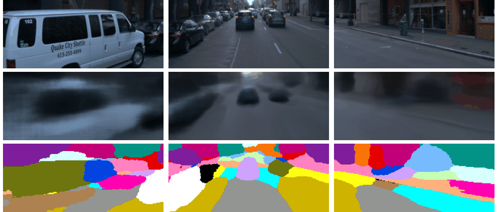

# Self-supervised Object-Centric Segmentation (SOCS)

Code repository for the paper "Linking vision and motion for self-supervised object-centric perception."

## Installation

A virtual environment with Python 3.9 is recommended.

<pre><code>pip install -r requirements.txt</code></pre>

## Dataset generation
We ran our experiments with the Waymo Open Perception dataset v1.4, which didn't provide utilities for loading contiguous frame sequences. Therefore, we first extract frame sequences for train and val splits using the `dataset_generation.py` script. First, download the [dataset](https://waymo.com/intl/en_us/open/download/) so that the local file structure looks like:

<pre><code>waymo_open_raw
    train
        segment-10017090168044687777_6380_000_6400_000_with_camera_labels.tfrecord
        ...
    val
        segment-10203656353524179475_7625_000_7645_000_with_camera_labels.tfrecord
        ...</code></pre>
        
Then, install the Waymo Open dataset utilities from the [official repo](https://github.com/waymo-research/waymo-open-dataset). (It's recommended to do this in a separate virtual environment.) Run the data generation script for the train and val splits:

<pre><code>python dataset_generation.py train
python dataset_generation.py val</code></pre>

You should end up with 40,000 train sequences and 208 val sequences. Unfortunately, it's time-consuming to iterate through the dataset multiple times and generate the sequences. For new code it may be preferable to take advantage of the new dataloading tools provided with the 2.0 release of the dataset.

## Training

Simply run:
<pre><code>python main.py --behvaioral_cloning_task</code></pre>

In addition to the batch size, memory consumption depends on the `--downsample_factor` flag (what fraction of pixels are decoded for each sequence in the training batch).

## Inference

Quantitative metrics and video clips of the qualitative results can be generated using the `analysis.py` script. By default it runs inference on a single random train and val sequence. To generate complete validation metrics, run:

<pre><code>python analysis.py example_logdir/version_0 --split val --num_seq_to_analyze 208 --num_seq_to_plot 10 --gpu 0</code></pre>

The GPU memory requirements can be reduced by setting the `--parallel_pix` flag to a smaller value. Additional figures in the paper were generated with the functions in `figures.py`.